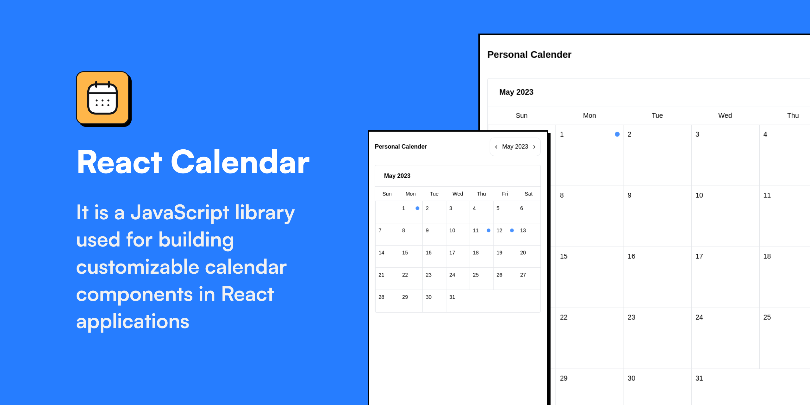
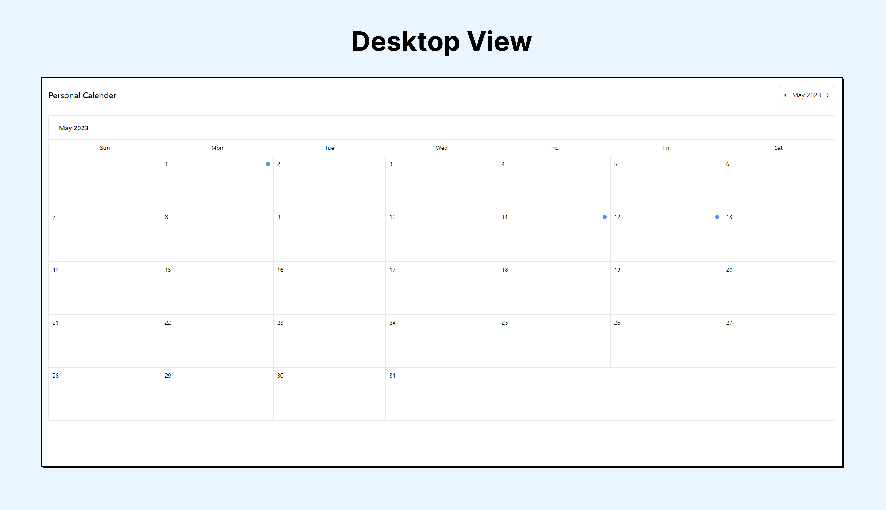
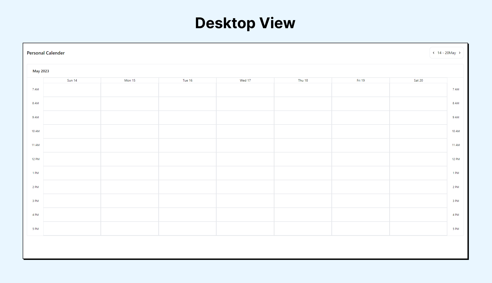
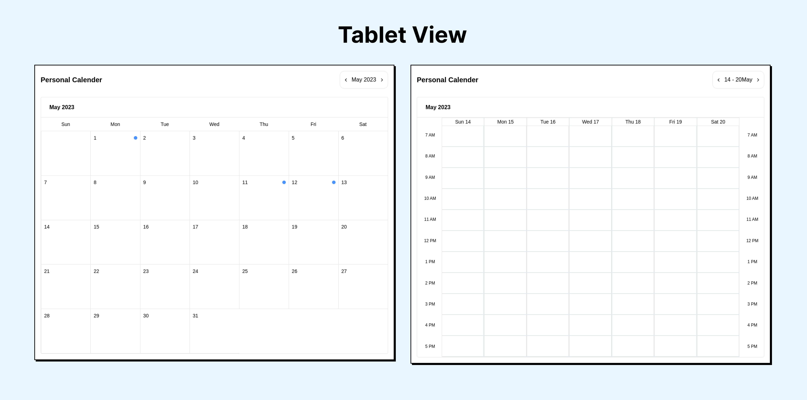
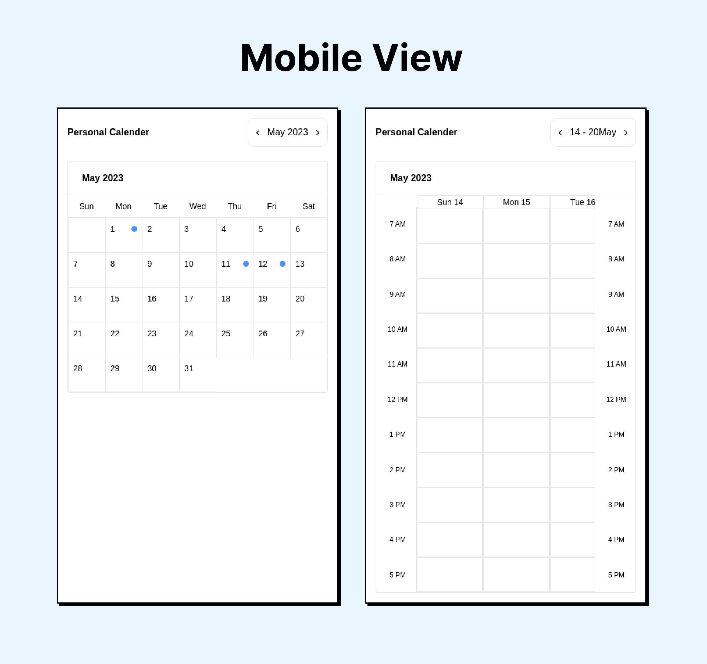
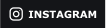

<div align='center'>
 
</div>

# React Calender

This is a low-level component for rendering monthly and weekly calendars using React.

## Features

- **Week View:** Display the calendar in a weekly format, showing individual days of the week horizontally. Each day have separate columns or sections to represent different time slots.

- **Month View:** Display the calendar in a monthly format, showing all days of the month in a grid layout. Each day should provide a summary of the events scheduled for that day.

- **Event Display:** Show events as blocks or markers within the calendar grid. In both week and month views, events should be visually distinguishable and displayed in their respective time slots.

- **Event Details Modal:** When a user clicks on an event in the calendar, open a modal window displaying detailed information about the event. This should include the event title, description, start and end time, and any other relevant information.

## Screenshots







 

## Tech Stack

**Client:** Next, TailwindCSS

## Getting Started

Clone the project

```bash
  git clone https://github.com/solguruz/react-calendar.git
```

Go to the project directory

```bash
  cd react-calender
```

Install dependencies

```bash
  npm install
```

Start the server

```bash
  npm run dev
```

## Usage/Examples

```javascript
import Calender from '../feature/Calender'

const data = [
  {
    date: '05/01/2023',
    task: [
      {
        startTime: '07:00 AM',
        endTime: '8:00 AM',
        title: 'Work Policy',
      },
      {
        startTime: '8:00 Am',
        endTime: '9:00 Am',
        title: 'Work Name',
      },
    ],
  },
  {
    date: '28/06/2023',
    task: [
      {
        startTime: '7:00 Am',
        endTime: '8:00 Am',
        title: 'Work Policy',
      },
      {
        startTime: '8:00 Am',
        endTime: '9:00 Am',
        title: 'Work Name',
      },
    ],
  },
];

<!-- Month View -->
const App = () => {
  return <Calender name="Personal Calender" type="month" data={data} />;
}

<!-- Week View -->
const App = () => {
  return <Calender name="Personal Calender" type="week" data={data} />;
}
```

## 🚀 About Us

Engineering Quality Solutions by employing technologies with Passion and Love | Web and Mobile App Development Company in India and Canada

## 🔗 Links

<div align="left">
<a href="https://solguruz.com/" target="_blank">

</a>
<a href="https://www.facebook.com/SolGuruzHQ" target="_blank">

</a>

<a href="https://www.linkedin.com/company/solguruz/" target="_blank">

</a>
<a href="https://www.instagram.com/solguruz/" target="_blank">

</a>

<a href="https://twitter.com/SolGuruz" target="_blank">

</a>
<a href="https://www.behance.net/solguruz" target="_blank">

</a>
<a href="https://dribbble.com/SolGuruz" target="_blank">

</a>

</div>

## Contributing

Contributions are always welcome!

See `contributing.md` for ways to get started.

Please adhere to this project's `code of conduct`.

## License

```text
MIT License

Copyright (c) 2023 SolGuruz LLP

Permission is hereby granted, free of charge, to any person obtaining a copy
of this software and associated documentation files (the "Software"), to deal
in the Software without restriction, including without limitation the rights
to use, copy, modify, merge, publish, distribute, sublicense, and/or sell
copies of the Software, and to permit persons to whom the Software is
furnished to do so, subject to the following conditions:

The above copyright notice and this permission notice shall be included in all
copies or substantial portions of the Software.

THE SOFTWARE IS PROVIDED "AS IS", WITHOUT WARRANTY OF ANY KIND, EXPRESS OR
IMPLIED, INCLUDING BUT NOT LIMITED TO THE WARRANTIES OF MERCHANTABILITY,
FITNESS FOR A PARTICULAR PURPOSE AND NONINFRINGEMENT. IN NO EVENT SHALL THE
AUTHORS OR COPYRIGHT HOLDERS BE LIABLE FOR ANY CLAIM, DAMAGES OR OTHER
LIABILITY, WHETHER IN AN ACTION OF CONTRACT, TORT OR OTHERWISE, ARISING FROM,
OUT OF OR IN CONNECTION WITH THE SOFTWARE OR THE USE OR OTHER DEALINGS IN THE
SOFTWARE.
```
